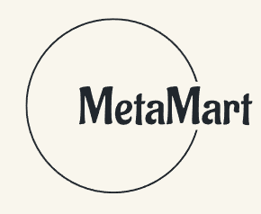
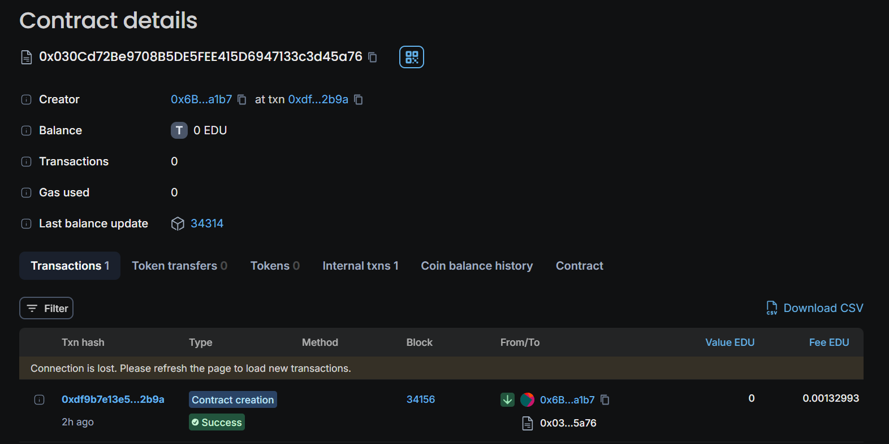
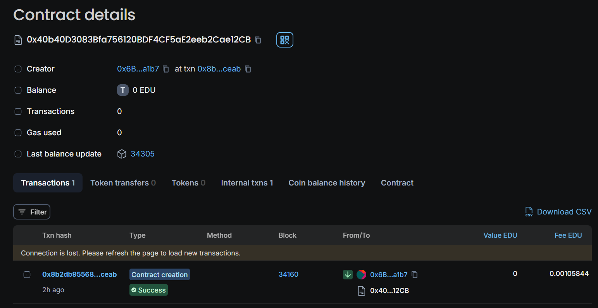

# Metamart

## Project Description

**Metamart** is a Solidity-based smart contract designed for an e-commerce platform on the Ethereum blockchain. This project aims to provide a decentralized marketplace where buyers and sellers can interact directly, eliminating the need for intermediaries. By leveraging the transparency, security, and immutability of blockchain technology, Metamart ensures trustless transactions and fosters a fair trading environment.

## Key Features

- **Decentralized Marketplace**: Metamart operates without intermediaries, enabling direct interaction between buyers and sellers.
- **Secure Transactions**: All transactions are recorded on the Ethereum blockchain, ensuring transparency and security.
- **Immutable Records**: Once a transaction is recorded, it cannot be altered, providing a tamper-proof history of all marketplace activities.
- **Smart Contract Automation**: The platform uses smart contracts to automate order processing, payment handling, and dispute resolution.
- **Scalability**: Designed to accommodate a growing number of users and transactions without compromising performance.

## Project Vision

Metamart envisions a future where e-commerce is fully decentralized, offering users a secure, transparent, and efficient platform for buying and selling goods and services. By eliminating intermediaries, Metamart aims to reduce costs, increase trust, and empower individuals to engage in global trade with confidence. The project seeks to demonstrate the potential of blockchain technology to revolutionize traditional commerce systems, setting a new standard for online marketplaces.

## **Contract Address** 

- **Network:** Educhain
- **Contract Address** 0x030Cd72Be9708B5DE5FEE415D6947133c3d45a76

- **Contract Address** 0x40b40D3083Bfa756120BDF4CF5aE2eeb2Cae12CB

## **Contact Information**

- **Developer :** Bibek Das
- **Email :** bibekdas765@gmail.com
- **GitHub :**  https://github.com/itswayne23/metamart
- **LinkedIn :** www.linkedin.com/in/bibek-das-370817259
